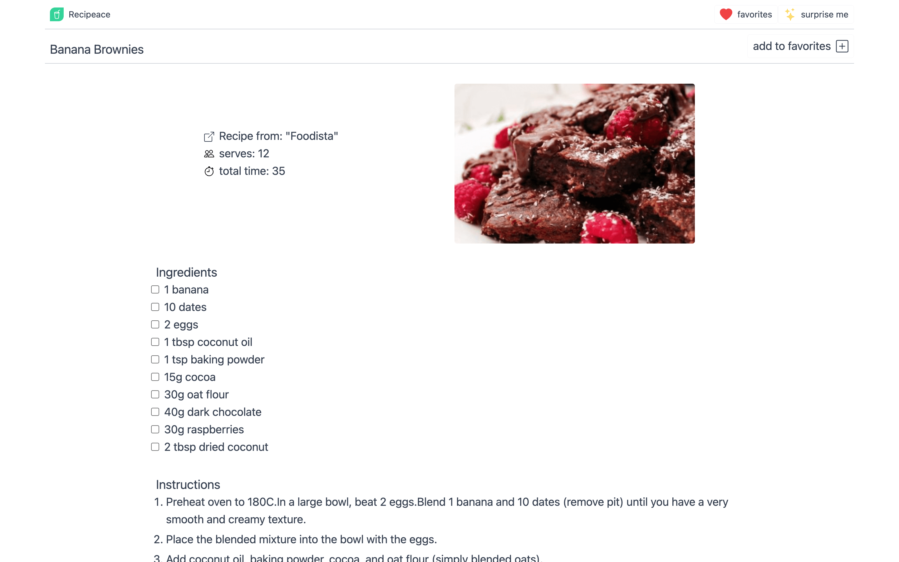

## Recipeace - discover new recipes

#### Designed and built by Carolyn Lau

### Overview

Recipeace allows the user to discover new recipes and cooking inspiration. As an API connected app, users are able to:

1.  Search for recipes by ingredient or recipe name.
2.  Navigate between pages of search results.
3.  View recipe details by clicking on a recipe card.
4.  Add a recipe to the favorites list from the results page or recipe details page.
5.  Delete items from the favorites list.
6.  View a randomized recipe via the 'surprise me' button.

Search results and favorited recipes are saved to local storage.

#### View Live Site

Live site URL: [[Recipeace]](https://the-cl.github.io/recipe-app/surprise)

### Screenshots

### Built with

- Tailwind CSS [[tailwindcss.com]](https://tailwindcss.com/)
- React JS Library [[reactjs.org]](https://reactjs.org/)
- React Router [[react-router-dom]](https://v5.reactrouter.com/web/guides/quick-start)
- Spoonacular API [[spoonacular.com]](https://spoonacular.com/)
- Bootstrapped with [[Create React App]](https://github.com/facebook/create-react-app)

### Set-up

1. Clone this repository to your desktop. [[https://github.com/the-cl/recipe-app.git]](https://github.com/the-cl/recipe-app.git)
2. From your device's terminal, `cd` into the project directory.
3. Run `npm start` to open the app in the development mode and view it in your browser. [[localhost:3000]](http://localhost:3000)
4. Run `npm run build` to create your optimized production build.

### Project Goals and Challenges

As a recipe discovery app, it was important for users to be able to favorite recipes, and to have access to that information even on page reload. I also wanted the option to view more search results, and therefore implemented the pagination fucntionality.

Due to the client-side-rendering nature of React Router, my application would encouter a 404 error if the user refreshed the app after navigating from the home page. A special thank you to Rafael Pedicini for the redirect script.

### Continued development

I am growing more comfortable passing props and managing `useEffect` hooks. In future projects, I would like to implement custom hooks to manage the API calls.

As the size of my application grows, managing state and passing props across components can get bulky. In future projects, I would like to implement a state management library such as React Redux to streamline my data.

### Acknowledgements

Page refresh redirect script courtesy of [Rafael Pedicini](https://github.com/rafgraph/spa-github-pages).
